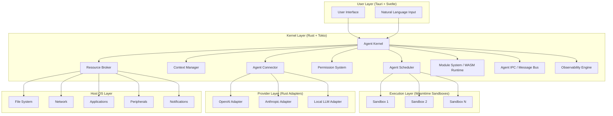
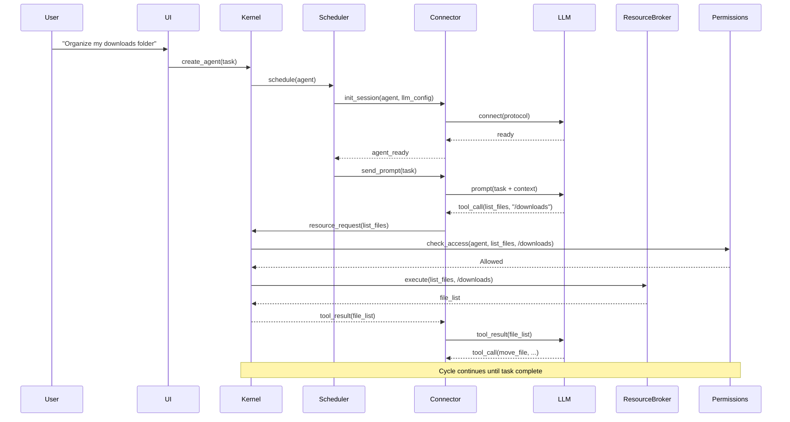
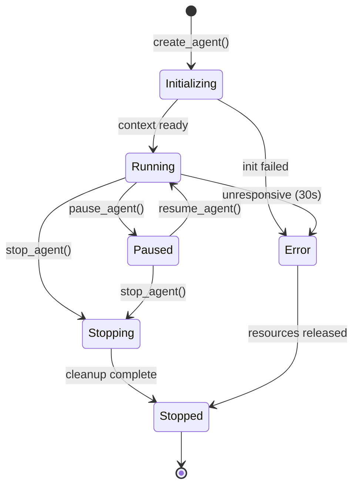
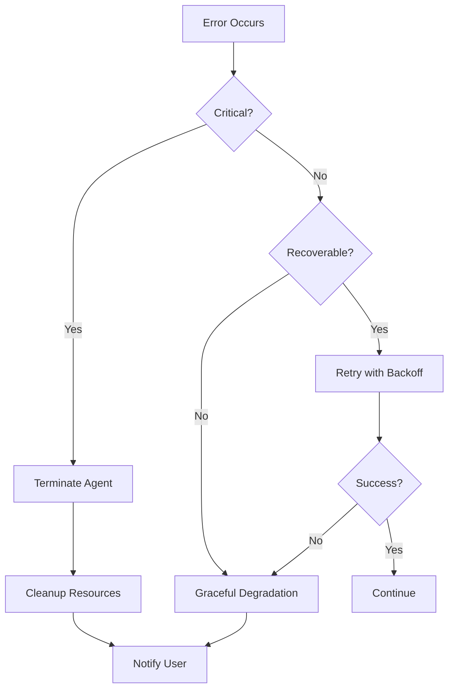

# Design Document: AI Agent OS

## Overview

The AI Agent OS is a user-space application that provides an operating system abstraction layer purpose-built for LLM-based AI agents. It sits between the host OS and LLM providers, managing agent lifecycles, scheduling, memory, resource access, permissions, and inter-agent communication — much like a traditional OS kernel manages processes, but tailored for the unique characteristics of LLM agents (token-limited context, non-deterministic execution, tool-calling patterns).

The system is designed as a modular, event-driven architecture where a central kernel orchestrates subsystems through well-defined internal interfaces. It runs as a native desktop application on Windows, macOS, and Linux, requiring no kernel-level modifications to the host OS.

### Technology Stack

| Layer | Technology | Rationale |
|-------|-----------|-----------|
| Agent Kernel | **Rust** | Memory safety without GC, C-level performance, compile-time concurrency guarantees |
| Async Runtime | **Tokio** | Industry-standard async runtime for Rust, non-blocking concurrent agent management |
| Sandbox Isolation | **Rust + OS primitives** | Linux namespaces/seccomp, macOS App Sandbox, Windows Job Objects |
| Module Runtime | **WebAssembly (Wasmtime)** | Language-agnostic modules with sandboxed execution, any language compiles to WASM |
| Storage | **SQLite (rusqlite)** + embedded vector DB | Local, zero-config, proven reliability |
| LLM Connector | **reqwest** (HTTP) + **tokio-tungstenite** (WebSocket) | Async streaming from LLM APIs |
| Desktop Shell | **Tauri 2** | Rust backend + native webview, ~8MB installer, 20-40MB RAM |
| Frontend UI | **Svelte** (TypeScript) | Lightweight, reactive, fast compilation |
| Serialization | **serde** + **serde_json** | Zero-cost serialization/deserialization |
| Property-Based Testing | **proptest** | Rust-native PBT framework, equivalent to fast-check/QuickCheck |
| IPC / Message Bus | **tokio::sync** (mpsc, broadcast channels) | Lock-free async message passing |

### Key Design Decisions

1. **Rust for the kernel** — Memory safety without garbage collection is critical for a system managing sandboxes, permissions, and concurrent agents. Rust's ownership model prevents data races at compile time. The Linux kernel, Microsoft Windows, and Redox OS all use Rust for systems-level code.

2. **User-space application, not a real OS kernel** — Runs as a regular application to avoid installation complexity and host OS conflicts. Uses OS-level sandboxing primitives (namespaces, seccomp, filesystem jails) rather than hardware isolation.

3. **Event-driven kernel with async message bus** — All subsystems communicate through Tokio broadcast/mpsc channels, enabling loose coupling and runtime extensibility without shared mutable state.

4. **WebAssembly module system** — Modules compile to WASM and run in Wasmtime sandboxes. Developers can write modules in Rust, C, Go, AssemblyScript, or any language that targets WASM. A crashed module cannot take down the kernel.

5. **LLM-agnostic protocol layer** — A standardized agent protocol (Rust traits) abstracts away provider differences, with adapter modules translating to/from provider-specific formats.

6. **Sandbox-first execution model** — Agents start sandboxed by default, with permissions escalated explicitly by the user.

7. **Tauri for desktop delivery** — Rust backend with native webview (not bundled Chromium). 96% smaller than Electron, half the memory footprint, with full access to Rust's systems capabilities from the backend.

## Architecture

The system follows a layered architecture with the Agent Kernel at the center:



### Component Interaction Flow



## Components and Interfaces

### 1. Agent Kernel (Core Orchestrator)

The central coordinator that manages agent lifecycle state machines and routes requests between subsystems.

```rust
use tokio::sync::{mpsc, broadcast};

/// Unique identifiers
pub type AgentId = uuid::Uuid;
pub type SessionId = uuid::Uuid;
pub type ProviderId = String;
pub type PermissionProfileId = String;

/// Agent lifecycle states
#[derive(Debug, Clone, PartialEq, Eq)]
pub enum AgentState {
    Initializing,
    Running,
    Paused,
    Stopping,
    Stopped,
    Error(String),
}

/// Priority levels (1 = highest, 5 = lowest)
#[derive(Debug, Clone, Copy, PartialEq, Eq, PartialOrd, Ord)]
pub struct Priority(u8); // constrained to 1..=5

/// Configuration for creating a new agent
#[derive(Debug, Clone)]
pub struct AgentConfig {
    pub name: String,
    pub task: String,
    pub llm_provider: ProviderId,
    pub permission_profile: PermissionProfileId,
    pub priority: Priority,
    pub sandbox_config: Option<SandboxConfig>,
}

/// Handle to a running agent
pub struct AgentHandle {
    pub id: AgentId,
    pub state: AgentState,
    cmd_tx: mpsc::Sender<AgentCommand>,
}

/// Kernel events broadcast to subsystems
#[derive(Debug, Clone)]
pub enum KernelEvent {
    AgentCreated(AgentId),
    AgentStateChanged { agent_id: AgentId, old: AgentState, new: AgentState },
    ResourceRequested { agent_id: AgentId, resource: ResourceType, operation: String },
    ShutdownInitiated,
}

/// The Agent Kernel trait
#[async_trait::async_trait]
pub trait AgentKernel: Send + Sync {
    // Lifecycle
    async fn create_agent(&self, config: AgentConfig) -> Result<AgentHandle, KernelError>;
    async fn pause_agent(&self, agent_id: AgentId) -> Result<(), KernelError>;
    async fn resume_agent(&self, agent_id: AgentId) -> Result<(), KernelError>;
    async fn stop_agent(&self, agent_id: AgentId) -> Result<(), KernelError>;

    // State queries
    fn get_agent_state(&self, agent_id: AgentId) -> Option<AgentState>;
    fn list_agents(&self, session_id: Option<SessionId>) -> Vec<AgentInfo>;

    // Event system
    fn subscribe_events(&self) -> broadcast::Receiver<KernelEvent>;
}
```

### 2. Agent Scheduler

Manages concurrent agent execution with priority-based scheduling and resource-aware throttling.

```rust
/// Scheduler status snapshot
#[derive(Debug, Clone)]
pub struct SchedulerStatus {
    pub running_agents: usize,
    pub queued_agents: usize,
    pub resource_utilization: ResourceMetrics,
}

/// The Agent Scheduler trait
#[async_trait::async_trait]
pub trait AgentScheduler: Send + Sync {
    async fn schedule(&self, agent: &AgentHandle) -> Result<(), SchedulerError>;
    async fn suspend(&self, agent_id: AgentId) -> Result<(), SchedulerError>;
    async fn resume(&self, agent_id: AgentId) -> Result<(), SchedulerError>;
    fn set_priority(&self, agent_id: AgentId, priority: Priority);
    fn get_queue_status(&self) -> SchedulerStatus;
}
```

**Scheduling Strategy**: Cooperative scheduling with preemption. Agents yield control between LLM calls (natural yield points via `.await`). Under resource pressure, lower-priority agents have their execution rate throttled (increased delay between LLM calls) before higher-priority agents are affected. Tokio's task system provides the underlying cooperative multitasking.

### 3. Context Manager

Handles agent memory — both short-term (conversation context) and long-term (persistent memory store).

```rust
use chrono::{DateTime, Utc};

/// Agent's working context
#[derive(Debug, Clone, serde::Serialize, serde::Deserialize)]
pub struct AgentContext {
    pub conversation_history: Vec<Message>,
    pub working_state: serde_json::Value,
    pub active_tasks: Vec<Task>,
    pub intermediate_results: Vec<TaskResult>,
    pub token_count: u32,
}

/// A fact stored in long-term memory
#[derive(Debug, Clone, serde::Serialize, serde::Deserialize)]
pub struct Fact {
    pub id: uuid::Uuid,
    pub content: String,
    pub category: FactCategory,
    pub created_at: DateTime<Utc>,
    pub last_accessed_at: DateTime<Utc>,
    pub embedding: Option<Vec<f32>>,
}

#[derive(Debug, Clone, serde::Serialize, serde::Deserialize)]
pub enum FactCategory {
    Preference,
    LearnedPattern,
    Fact,
    Instruction,
}

/// The Context Manager trait
#[async_trait::async_trait]
pub trait ContextManager: Send + Sync {
    // Session context
    async fn create_context(&self, agent_id: AgentId) -> Result<(), ContextError>;
    async fn get_context(&self, agent_id: AgentId) -> Result<AgentContext, ContextError>;
    async fn persist_context(&self, agent_id: AgentId) -> Result<(), ContextError>;
    async fn restore_context(&self, agent_id: AgentId) -> Result<AgentContext, ContextError>;

    // Context window management
    async fn summarize_overflow(&self, context: &AgentContext, token_limit: u32) -> Result<AgentContext, ContextError>;

    // Long-term memory
    async fn store_fact(&self, agent_id: AgentId, fact: Fact) -> Result<(), ContextError>;
    async fn query_memory(&self, agent_id: AgentId, query: &str) -> Result<Vec<Fact>, ContextError>;
}
```

**Summarization Strategy**: When context exceeds 80% of the LLM's token limit, the Context Manager triggers summarization of the oldest conversation segments. Summaries are generated by a dedicated summarization call to the LLM, and the original messages are archived to persistent storage (SQLite).

### 4. Resource Broker

Mediates all agent access to host system resources through a unified API.

```rust
/// Resource types available to agents
#[derive(Debug, Clone, PartialEq, Eq, Hash, serde::Serialize, serde::Deserialize)]
pub enum ResourceType {
    Filesystem,
    Application,
    Browser,
    Peripheral,
    Network,
}

/// A request from an agent to access a resource
#[derive(Debug, Clone)]
pub struct ResourceRequest {
    pub agent_id: AgentId,
    pub resource_type: ResourceType,
    pub operation: String,
    pub parameters: serde_json::Value,
    pub sandbox_context: Option<SandboxId>,
}

/// Response from a resource operation
#[derive(Debug, Clone)]
pub struct ResourceResponse {
    pub success: bool,
    pub data: serde_json::Value,
    pub error: Option<String>,
}

/// A pluggable resource provider (implemented as WASM modules or native)
#[async_trait::async_trait]
pub trait ResourceProvider: Send + Sync {
    fn resource_type(&self) -> ResourceType;
    fn supported_operations(&self) -> Vec<String>;
    async fn execute(&self, operation: &str, params: &serde_json::Value) -> Result<serde_json::Value, ResourceError>;
}

/// The Resource Broker trait
#[async_trait::async_trait]
pub trait ResourceBroker: Send + Sync {
    async fn execute(&self, request: ResourceRequest) -> Result<ResourceResponse, ResourceError>;
    fn list_capabilities(&self) -> Vec<ResourceCapability>;
    fn register_provider(&self, provider: Box<dyn ResourceProvider>);
}
```

### 5. Permission System

Enforces access control with role-based profiles and action-level granularity.

```rust
/// Access decision for a resource request
#[derive(Debug, Clone, PartialEq, Eq, serde::Serialize, serde::Deserialize)]
pub enum AccessDecision {
    Allowed,
    Denied,
    RequiresApproval,
}

/// A single permission rule
#[derive(Debug, Clone, serde::Serialize, serde::Deserialize)]
pub struct PermissionRule {
    pub resource_type: ResourceType,
    pub operations: Vec<String>,
    pub targets: Option<Vec<String>>, // glob patterns for paths, URLs, etc.
    pub decision: AccessDecision,
}

/// A named permission profile
#[derive(Debug, Clone, serde::Serialize, serde::Deserialize)]
pub struct PermissionProfile {
    pub id: PermissionProfileId,
    pub name: String,
    pub rules: Vec<PermissionRule>,
}

/// Audit log entry
#[derive(Debug, Clone, serde::Serialize, serde::Deserialize)]
pub struct AuditEntry {
    pub timestamp: DateTime<Utc>,
    pub agent_id: AgentId,
    pub action: String,
    pub resource: String,
    pub decision: AccessDecision,
    pub outcome: ActionOutcome,
}

#[derive(Debug, Clone, serde::Serialize, serde::Deserialize)]
pub enum ActionOutcome {
    Success,
    Failure,
    Pending,
    Timeout,
}

/// The Permission System trait
#[async_trait::async_trait]
pub trait PermissionSystem: Send + Sync {
    fn check_access(&self, agent_id: AgentId, resource: &ResourceType, operation: &str, target: Option<&str>) -> AccessDecision;
    async fn request_elevation(&self, agent_id: AgentId, action: &str) -> Result<AccessDecision, PermissionError>;
    fn assign_profile(&self, agent_id: AgentId, profile_id: &PermissionProfileId);
    fn get_audit_log(&self, filter: Option<&AuditFilter>) -> Vec<AuditEntry>;
}
```

**Predefined Profiles**:
- `read-only`: Can read files and browse web, cannot modify anything
- `standard`: Can read/write within sandbox, browse web, launch approved apps
- `elevated`: Full file system access, network access, app launching
- `full-access`: Unrestricted (requires explicit user acknowledgment)

### 6. Agent Connector

Abstracts LLM provider differences behind a standardized protocol.

```rust
/// Standard message format (provider-agnostic)
#[derive(Debug, Clone, serde::Serialize, serde::Deserialize)]
pub struct StandardMessage {
    pub role: MessageRole,
    pub content: MessageContent,
    pub tool_calls: Option<Vec<ToolCall>>,
    pub tool_results: Option<Vec<ToolResult>>,
}

#[derive(Debug, Clone, serde::Serialize, serde::Deserialize)]
pub enum MessageRole {
    System,
    User,
    Assistant,
    Tool,
}

#[derive(Debug, Clone, serde::Serialize, serde::Deserialize)]
pub enum MessageContent {
    Text(String),
    Blocks(Vec<ContentBlock>),
}

/// An LLM session for sending prompts and receiving responses
#[async_trait::async_trait]
pub trait LlmSession: Send + Sync {
    async fn send_prompt(&self, messages: &[StandardMessage], tools: Option<&[ToolDefinition]>) -> Result<LlmResponse, ConnectorError>;
    async fn stream(&self, messages: &[StandardMessage], tools: Option<&[ToolDefinition]>) -> Result<Pin<Box<dyn Stream<Item = LlmChunk> + Send>>, ConnectorError>;
    fn get_token_count(&self, messages: &[StandardMessage]) -> u32;
    async fn disconnect(&self) -> Result<(), ConnectorError>;
}

/// Adapter for a specific LLM provider
#[async_trait::async_trait]
pub trait LlmProviderAdapter: Send + Sync {
    fn id(&self) -> &ProviderId;
    fn name(&self) -> &str;
    fn provider_type(&self) -> ProviderType; // Cloud or Local
    async fn connect(&self, config: &ProviderConfig) -> Result<Box<dyn LlmSession>, ConnectorError>;
    fn validate_protocol(&self) -> ValidationResult;
}

/// The Agent Connector trait
#[async_trait::async_trait]
pub trait AgentConnector: Send + Sync {
    fn register_provider(&self, provider: Box<dyn LlmProviderAdapter>);
    async fn connect(&self, agent_id: AgentId, provider_id: &ProviderId) -> Result<Box<dyn LlmSession>, ConnectorError>;
    fn list_providers(&self) -> Vec<ProviderInfo>;
}

#[derive(Debug, Clone)]
pub enum ProviderType {
    Cloud,
    Local,
}
```

### 7. Module System (WASM-based)

Manages runtime loading/unloading of extensions. Modules compile to WebAssembly and run in Wasmtime sandboxes, enabling language-agnostic extensibility with crash isolation.

```rust
use std::path::PathBuf;

pub type ModuleId = String;
pub type SandboxId = uuid::Uuid;

/// Module status
#[derive(Debug, Clone, PartialEq, Eq, serde::Serialize, serde::Deserialize)]
pub enum ModuleStatus {
    Installed,
    Loaded,
    Active,
    Error(String),
    Disabled,
}

/// Information about an installed module
#[derive(Debug, Clone, serde::Serialize, serde::Deserialize)]
pub struct ModuleInfo {
    pub id: ModuleId,
    pub name: String,
    pub version: String,
    pub status: ModuleStatus,
    pub declared_permissions: Vec<PermissionRule>,
    pub declared_capabilities: Vec<String>,
    pub resource_requirements: ResourceRequirements,
}

/// Resource requirements declared by a module
#[derive(Debug, Clone, serde::Serialize, serde::Deserialize)]
pub struct ResourceRequirements {
    pub max_memory_bytes: Option<u64>,
    pub max_cpu_time_ms: Option<u64>,
    pub network_access: bool,
    pub filesystem_access: Vec<String>, // allowed path patterns
}

/// Kernel services exposed to modules via WASM host functions
pub struct KernelServicesApi {
    pub resources: Arc<dyn ResourceBroker>,
    pub scheduler: Arc<dyn AgentScheduler>,
    pub context: Arc<dyn ContextManager>,
    pub permissions: Arc<dyn PermissionSystem>,
    pub events: broadcast::Sender<KernelEvent>,
}

/// The Module System trait
#[async_trait::async_trait]
pub trait ModuleSystem: Send + Sync {
    async fn install(&self, module_path: &PathBuf) -> Result<ModuleInfo, ModuleError>;
    async fn uninstall(&self, module_id: &ModuleId) -> Result<(), ModuleError>;
    async fn load(&self, module_id: &ModuleId) -> Result<(), ModuleError>;
    async fn unload(&self, module_id: &ModuleId) -> Result<(), ModuleError>;
    fn list_modules(&self) -> Vec<ModuleInfo>;
}
```

**WASM Module Architecture**: Each module is compiled to a `.wasm` binary and loaded into a Wasmtime instance with resource limits (memory cap, CPU time cap, restricted syscalls). The kernel exposes host functions that modules call to interact with kernel services. If a module traps (panics/crashes), Wasmtime catches it cleanly — the kernel logs the failure, unloads the module, and continues operating.

### 8. Agent IPC (Inter-Process Communication)

Handles agent-to-agent messaging and pub/sub patterns using Tokio channels.

```rust
/// A message between agents
#[derive(Debug, Clone, serde::Serialize, serde::Deserialize)]
pub struct IpcMessage {
    pub id: uuid::Uuid,
    pub message_type: String,
    pub payload: serde_json::Value,
    pub timestamp: DateTime<Utc>,
    pub reply_to: Option<uuid::Uuid>,
}

/// Node in a delegation chain
#[derive(Debug, Clone, serde::Serialize, serde::Deserialize)]
pub struct DelegationNode {
    pub agent_id: AgentId,
    pub task_id: uuid::Uuid,
    pub status: DelegationStatus,
    pub children: Vec<DelegationNode>,
}

#[derive(Debug, Clone, PartialEq, Eq, serde::Serialize, serde::Deserialize)]
pub enum DelegationStatus {
    Pending,
    InProgress,
    Completed,
    Failed,
}

/// The Agent IPC trait
#[async_trait::async_trait]
pub trait AgentIpc: Send + Sync {
    // Direct messaging
    async fn send(&self, from: AgentId, to: AgentId, message: IpcMessage) -> Result<(), IpcError>;

    // Pub/Sub
    fn subscribe(&self, agent_id: AgentId, topic: &str);
    fn unsubscribe(&self, agent_id: AgentId, topic: &str);
    async fn publish(&self, agent_id: AgentId, topic: &str, payload: serde_json::Value) -> Result<(), IpcError>;

    // Task delegation
    async fn delegate(&self, from: AgentId, to: AgentId, subtask: Task) -> Result<TaskResult, IpcError>;
    fn get_delegation_chain(&self, task_id: uuid::Uuid) -> Option<DelegationNode>;
}
```

### 9. Observability Engine

Provides real-time monitoring, logging, and transparency features.

```rust
/// An action performed by an agent
#[derive(Debug, Clone, serde::Serialize, serde::Deserialize)]
pub struct AgentAction {
    pub id: uuid::Uuid,
    pub action_type: String,
    pub description: String,
    pub resources_accessed: Vec<String>,
    pub reasoning: Option<String>,
    pub plan_context: Option<PlanStep>,
    pub timestamp: DateTime<Utc>,
}

/// Resource usage metrics
#[derive(Debug, Clone, Default, serde::Serialize, serde::Deserialize)]
pub struct Metrics {
    pub tokens_consumed: u64,
    pub api_calls_made: u64,
    pub files_modified: Vec<String>,
    pub time_elapsed_ms: u64,
    pub resource_usage: ResourceMetrics,
}

/// A step in an agent's plan
#[derive(Debug, Clone, serde::Serialize, serde::Deserialize)]
pub struct PlanStep {
    pub step_number: u32,
    pub description: String,
    pub status: PlanStepStatus,
}

#[derive(Debug, Clone, PartialEq, Eq, serde::Serialize, serde::Deserialize)]
pub enum PlanStepStatus {
    Pending,
    InProgress,
    Completed,
    Skipped,
}

/// The Observability Engine trait
#[async_trait::async_trait]
pub trait ObservabilityEngine: Send + Sync {
    fn log_action(&self, agent_id: AgentId, action: AgentAction);
    fn get_activity_log(&self, agent_id: AgentId, filter: Option<&LogFilter>) -> Vec<AgentAction>;
    fn get_reasoning_chain(&self, agent_id: AgentId, action_id: uuid::Uuid) -> Option<Vec<ReasoningStep>>;
    fn get_agent_plan(&self, agent_id: AgentId) -> Vec<PlanStep>;
    fn get_metrics(&self, scope: MetricScope) -> Metrics;
    fn on_deviation(&self, handler: Box<dyn Fn(AgentId, &AgentAction) + Send + Sync>);
}
```

### 10. Sandbox Manager

Creates and manages isolated execution environments using OS-native primitives.

```rust
/// Sandbox configuration
#[derive(Debug, Clone, serde::Serialize, serde::Deserialize)]
pub struct SandboxConfig {
    pub workspace_dir: PathBuf,
    pub allowed_network_hosts: Option<Vec<String>>,
    pub max_disk_usage_bytes: Option<u64>,
    pub max_memory_bytes: Option<u64>,
    pub isolation_level: IsolationLevel,
}

/// Level of isolation for the sandbox
#[derive(Debug, Clone, PartialEq, Eq, serde::Serialize, serde::Deserialize)]
pub enum IsolationLevel {
    /// Filesystem-only isolation (chroot-like path restrictions)
    Filesystem,
    /// Process-level isolation (separate process with restricted syscalls)
    Process,
    /// Container-level isolation (Linux namespaces / Windows containers)
    Container,
}

/// Result of intercepting a sandboxed action
#[derive(Debug, Clone, PartialEq, Eq)]
pub enum InterceptResult {
    Allow,
    Deny,
    PromptUser,
}

/// The Sandbox Manager trait
#[async_trait::async_trait]
pub trait SandboxManager: Send + Sync {
    async fn create(&self, config: SandboxConfig) -> Result<SandboxId, SandboxError>;
    async fn destroy(&self, sandbox_id: SandboxId) -> Result<(), SandboxError>;
    fn get_status(&self, sandbox_id: SandboxId) -> Option<SandboxStatus>;
    fn intercept_action(&self, sandbox_id: SandboxId, request: &ResourceRequest) -> InterceptResult;
}
```

**Platform-specific isolation**:
- **Linux**: Uses `unshare` (namespaces) + `seccomp` for syscall filtering + `chroot` for filesystem isolation
- **macOS**: Uses App Sandbox entitlements + `sandbox-exec` profiles
- **Windows**: Uses Job Objects for resource limits + Restricted Tokens for access control

## Data Models

### Agent State Machine



### Core Data Entities

```rust
use chrono::{DateTime, Utc};
use serde::{Serialize, Deserialize};

/// Session - top-level execution context
#[derive(Debug, Clone, Serialize, Deserialize)]
pub struct Session {
    pub id: SessionId,
    pub user_id: String,
    pub agents: Vec<AgentId>,
    pub created_at: DateTime<Utc>,
    pub last_active_at: DateTime<Utc>,
    pub status: SessionStatus,
    pub metadata: serde_json::Value,
}

#[derive(Debug, Clone, PartialEq, Eq, Serialize, Deserialize)]
pub enum SessionStatus {
    Active,
    Paused,
    Archived,
}

/// Agent instance
#[derive(Debug, Clone, Serialize, Deserialize)]
pub struct Agent {
    pub id: AgentId,
    pub session_id: SessionId,
    pub name: String,
    pub state: AgentState,
    pub config: AgentConfig,
    pub sandbox_id: Option<SandboxId>,
    pub created_at: DateTime<Utc>,
    pub last_activity_at: DateTime<Utc>,
    pub metrics: Metrics,
}

/// Persisted context snapshot
#[derive(Debug, Clone, Serialize, Deserialize)]
pub struct ContextSnapshot {
    pub agent_id: AgentId,
    pub session_id: SessionId,
    pub conversation_history: Vec<Message>,
    pub working_state: serde_json::Value,
    pub active_tasks: Vec<Task>,
    pub intermediate_results: Vec<TaskResult>,
    pub summarized_segments: Vec<Summary>,
    pub token_count: u32,
    pub snapshot_at: DateTime<Utc>,
}

/// Long-term memory entry
#[derive(Debug, Clone, Serialize, Deserialize)]
pub struct MemoryEntry {
    pub id: uuid::Uuid,
    pub agent_id: AgentId,
    pub content: String,
    pub category: FactCategory,
    pub tags: Vec<String>,
    pub embedding: Vec<f32>,
    pub created_at: DateTime<Utc>,
    pub last_accessed_at: DateTime<Utc>,
    pub access_count: u32,
}

/// Module manifest (loaded from module's manifest.toml)
#[derive(Debug, Clone, Serialize, Deserialize)]
pub struct ModuleManifest {
    pub id: ModuleId,
    pub name: String,
    pub version: String,
    pub author: String,
    pub description: String,
    pub entry_point: String, // path to .wasm file
    pub permissions: Vec<PermissionRule>,
    pub capabilities: Vec<String>,
    pub dependencies: Vec<ModuleDependency>,
    pub resource_requirements: ResourceRequirements,
}

/// Audit log entry
#[derive(Debug, Clone, Serialize, Deserialize)]
pub struct AuditLogEntry {
    pub id: uuid::Uuid,
    pub timestamp: DateTime<Utc>,
    pub agent_id: AgentId,
    pub session_id: SessionId,
    pub action_type: String,
    pub resource: String,
    pub operation: String,
    pub target: Option<String>,
    pub decision: AccessDecision,
    pub outcome: ActionOutcome,
    pub metadata: Option<serde_json::Value>,
}
```

### Storage Strategy

| Data Type | Storage | Rust Crate | Rationale |
|-----------|---------|-----------|-----------|
| Agent state | In-memory (`DashMap`) + WAL | `dashmap`, custom WAL | Lock-free concurrent access, crash recovery |
| Conversation history | SQLite | `rusqlite` | Structured queries, local persistence |
| Long-term memory | SQLite + vector index | `rusqlite` + `usearch` or `qdrant` (embedded) | Semantic search via embeddings |
| Audit logs | Append-only log file | `std::fs` + `serde_json` | High write throughput, immutable |
| Module registry | TOML config file | `toml` | Rust-native config format, human-readable |
| User preferences | TOML config file | `toml` | Easy backup/restore |
| Sandbox state | Filesystem (per-sandbox dirs) | `std::fs` | Isolation, easy cleanup |

## Correctness Properties

*A property is a characteristic or behavior that should hold true across all valid executions of a system — essentially, a formal statement about what the system should do. Properties serve as the bridge between human-readable specifications and machine-verifiable correctness guarantees.*

### Property 1: Context persistence round-trip

*For any* agent with any conversation history, working state, active tasks, and intermediate results, persisting the context (via pause or session end) and then restoring it (via resume or session start) SHALL produce a context equivalent to the original.

**Validates: Requirements 1.2, 1.3, 3.1, 3.3**

### Property 2: Context summarization respects token limit

*For any* agent context that exceeds the configured LLM token limit, after summarization the resulting context's token count SHALL be less than or equal to the token limit.

**Validates: Requirements 3.2**

### Property 3: Long-term memory store/retrieve round-trip

*For any* valid Fact (with any content, category, and tags), storing it in the long-term memory and then querying for it SHALL return a result containing the original fact's content.

**Validates: Requirements 3.4**

### Property 4: Agent stop releases all resources

*For any* running agent holding any set of resources, stopping the agent SHALL result in zero held resources and the session being archived.

**Validates: Requirements 1.4**

### Property 5: Unresponsive agent termination and cleanup

*For any* agent that becomes unresponsive, the kernel SHALL terminate it, release all its held resources (resource count goes to zero), and generate a user notification.

**Validates: Requirements 1.5**

### Property 6: Priority-ordered resource access without deadlock

*For any* set of agents with distinct priorities competing for the same resource, access SHALL be granted in priority order (highest priority first) and all requests SHALL eventually complete (no deadlock).

**Validates: Requirements 2.2**

### Property 7: Priority-based throttling under resource pressure

*For any* set of agents with different priorities under resource constraints, the scheduler SHALL throttle lower-priority agents before higher-priority agents — i.e., for any two agents where agent A has higher priority than agent B, agent B's execution rate SHALL be reduced before agent A's.

**Validates: Requirements 2.3**

### Property 8: Permission enforcement matches profile rules

*For any* agent with a defined permission profile and any resource access request, the Permission_System's decision SHALL match the rules defined in that profile — allowed requests are granted, disallowed requests are blocked.

**Validates: Requirements 5.1, 5.2**

### Property 9: High-risk actions require user approval

*For any* action classified as high-risk (file deletion, email sending, purchases, credential access), the Permission_System SHALL return a 'RequiresApproval' decision regardless of the agent's permission profile (except full-access with explicit acknowledgment).

**Validates: Requirements 5.3**

### Property 10: Sandbox boundary enforcement

*For any* agent operating within a Sandbox, any action targeting a resource outside the sandbox boundary (files outside workspace directory, network resources without explicit permission) SHALL be intercepted, regardless of the agent's permission profile.

**Validates: Requirements 5.5, 9.2, 9.3, 9.4**

### Property 11: New agents are sandboxed by default

*For any* newly created agent where the user has not explicitly granted broader permissions, the agent SHALL be assigned to a Sandbox.

**Validates: Requirements 9.1**

### Property 12: Resource access always validates permissions

*For any* resource request from any agent, the Resource_Broker SHALL invoke the Permission_System's check_access before executing the request — no request bypasses permission validation.

**Validates: Requirements 4.6**

### Property 13: Provider protocol validation

*For any* LLM provider adapter submitted for registration, the Agent_Connector SHALL accept it if and only if it implements all required protocol trait methods. Adapters missing any required method SHALL be rejected (enforced at compile time via Rust traits).

**Validates: Requirements 6.2**

### Property 14: Protocol message translation round-trip

*For any* valid StandardMessage, translating it to a provider-specific format and then translating back SHALL produce a message semantically equivalent to the original (role, content, tool calls preserved).

**Validates: Requirements 6.5**

### Property 15: Module validation on install

*For any* Module manifest, the kernel SHALL validate declared permissions and resource requirements before activation — modules declaring permissions exceeding system policy or unavailable resources SHALL be rejected.

**Validates: Requirements 7.2**

### Property 16: Module crash isolation

*For any* set of loaded WASM modules where one module traps (panics/crashes), all other modules and all running agents SHALL continue operating without state corruption or interruption.

**Validates: Requirements 7.4**

### Property 17: Module registry accuracy

*For any* set of installed modules, the Module registry SHALL contain an entry for each module with correct name, version, status, and declared capabilities matching the module's manifest.

**Validates: Requirements 7.5**

### Property 18: Agent action audit logging completeness

*For any* agent action (resource access, decision, tool call), the system SHALL create a corresponding audit log entry containing timestamp, agent ID, resource identifier, action type, and outcome.

**Validates: Requirements 5.6, 12.1**

### Property 19: Pub/sub message delivery to all subscribers

*For any* agent subscribed to a topic, when any other agent publishes a message to that topic, the subscriber SHALL receive the message.

**Validates: Requirements 11.3**

### Property 20: IPC permission enforcement

*For any* inter-agent communication attempt, the Permission_System SHALL enforce user-defined communication policies — messages between agents not permitted to communicate SHALL be rejected.

**Validates: Requirements 11.4**

### Property 21: Delegation chain completion propagation

*For any* delegation chain of arbitrary depth, when the leaf task completes, completion status SHALL propagate back through every node in the chain to the originating agent.

**Validates: Requirements 11.5**

### Property 22: Plan deviation detection

*For any* agent action that does not match the agent's stated plan (next expected step), the system SHALL flag the deviation and generate a user notification.

**Validates: Requirements 12.4**

### Property 23: Resource metrics accuracy

*For any* sequence of agent activities, the reported metrics (tokens consumed, API calls made, files modified, time elapsed) SHALL accurately reflect the actual operations performed — metrics SHALL be monotonically non-decreasing and SHALL increment by the correct amount for each operation.

**Validates: Requirements 12.5**

### Property 24: Reasoning chain retrieval

*For any* agent action that has an associated reasoning chain, requesting an explanation for that action SHALL return the complete reasoning chain that led to the decision.

**Validates: Requirements 12.2**

### Property 25: Graceful shutdown persists all agent states

*For any* set of running agents at the time of system shutdown, all agent states SHALL be persisted and all sessions SHALL be terminated — no agent state is lost.

**Validates: Requirements 10.4**

### Property 26: System prerequisite validation

*For any* system configuration, the prerequisite checker SHALL correctly identify all deficiencies (RAM < 8GB, disk < 10GB, no internet) and report them — systems meeting all prerequisites SHALL pass, systems missing any SHALL report the specific deficiency.

**Validates: Requirements 10.2**

### Property 27: Sandbox isolation between agents

*For any* two agents in separate sandboxes, actions performed by one agent SHALL not modify the state visible to the other agent — each sandbox's state is independent.

**Validates: Requirements 9.5**

### Property 28: Notification generation for agent events

*For any* agent event of type completion, error, or approval request, the system SHALL generate a corresponding user notification.

**Validates: Requirements 8.6**

## Error Handling

### Error Categories and Strategies

| Error Category | Examples | Strategy |
|---|---|---|
| Agent Unresponsiveness | LLM timeout, infinite loop | 30-second watchdog timer (`tokio::time::timeout`) → terminate + cleanup + notify |
| LLM Provider Failure | API errors, rate limits, network issues | Retry with exponential backoff (`tokio::time::sleep`) → failover to backup → notify user |
| Context Persistence Failure | Disk full, I/O errors | Retry (3 attempts) → notify user → keep agent running with in-memory state |
| Module Crash (WASM trap) | Panic, out-of-bounds, stack overflow | Wasmtime catches trap → unload module → log → notify → continue kernel operation |
| Permission Violation | Unauthorized access attempt | Block action → log → notify user → continue agent execution |
| Sandbox Escape Attempt | Path traversal, network access | Intercept → block → log as security event → notify user |
| Resource Exhaustion | Memory limit, disk quota | Throttle agent → notify → pause if critical |
| IPC Delivery Failure | Target agent stopped, channel full | Retry → dead-letter queue → notify sender |

### Error Type Hierarchy

```rust
/// Top-level kernel error
#[derive(Debug, thiserror::Error)]
pub enum KernelError {
    #[error("Agent error: {0}")]
    Agent(#[from] AgentError),
    #[error("Scheduler error: {0}")]
    Scheduler(#[from] SchedulerError),
    #[error("Context error: {0}")]
    Context(#[from] ContextError),
    #[error("Resource error: {0}")]
    Resource(#[from] ResourceError),
    #[error("Permission error: {0}")]
    Permission(#[from] PermissionError),
    #[error("Connector error: {0}")]
    Connector(#[from] ConnectorError),
    #[error("Module error: {0}")]
    Module(#[from] ModuleError),
    #[error("IPC error: {0}")]
    Ipc(#[from] IpcError),
    #[error("Sandbox error: {0}")]
    Sandbox(#[from] SandboxError),
}

#[derive(Debug, thiserror::Error)]
pub enum AgentError {
    #[error("Agent {0} not found")]
    NotFound(AgentId),
    #[error("Agent {0} is unresponsive")]
    Unresponsive(AgentId),
    #[error("Invalid state transition from {from:?} to {to:?}")]
    InvalidTransition { from: AgentState, to: AgentState },
    #[error("Agent creation timeout")]
    CreationTimeout,
}
```

### Error Propagation Model



### Specific Error Handling Behaviors

1. **LLM Call Failures**: Retry up to 3 times with exponential backoff (1s, 2s, 4s) using `tokio::time::sleep`. On persistent failure, check for backup provider. If no backup or backup also fails, pause agent and notify user.

2. **Context Overflow**: When context approaches token limit (80% threshold), proactively summarize. If summarization itself fails (LLM unavailable), truncate oldest messages as fallback and log the truncation.

3. **Concurrent Resource Conflicts**: Use `tokio::sync::RwLock` for shared resources with optimistic locking for file operations. On conflict, queue the request and retry after the holding agent releases. Deadlock detection via timeout (10 seconds) — break deadlock by rolling back the lowest-priority agent's pending operation.

4. **Module Isolation (WASM)**: Modules run in Wasmtime instances with resource limits (`StoreLimits`). If a module traps, Wasmtime returns a `Trap` error — the kernel catches it, logs the failure, cleans up the module's registered resources, and continues. No shared memory between modules and kernel (communication via serialized messages).

5. **Sandbox Violations**: All resource requests from sandboxed agents pass through a sandbox interceptor before reaching the Resource Broker. Path canonicalization (`std::fs::canonicalize`) prevents traversal attacks. Network requests are checked against allowlists.

## Testing Strategy

### Testing Approach

The AI Agent OS uses a dual testing strategy combining property-based tests for universal correctness guarantees and example-based unit tests for specific scenarios and edge cases.

### Property-Based Testing

**Library**: [proptest](https://github.com/proptest-rs/proptest) (Rust)

**Configuration**: Minimum 256 test cases per property (configurable via `PROPTEST_CASES` env var).

**Tag Format**: Each property test is annotated with:
```rust
/// Feature: ai-agent-os, Property {number}: {property_text}
#[test]
fn prop_{number}_{short_name}() { ... }
```

**Properties to implement** (from Correctness Properties section):
- Properties 1–28 as defined above, each implemented as a single property-based test
- Arbitrary implementations for: `AgentConfig`, `AgentContext`, `Message`, `Fact`, `PermissionProfile`, `ResourceRequest`, `ModuleManifest`, `IpcMessage`, `DelegationNode`, `SandboxConfig`

### Unit Tests (Example-Based)

Focus areas:
- Agent state machine transitions (specific valid/invalid transition sequences)
- Scheduler capacity (10 concurrent agents via `tokio::test`)
- Default priority assignment
- Predefined permission profiles existence
- Module load/unload lifecycle
- WASM module trap handling
- Tauri command handlers

### Integration Tests

Focus areas:
- LLM provider failover (mock HTTP server via `wiremock`)
- Context persistence under storage errors (error injection)
- Host OS integration (notifications, file system, app launcher)
- Cross-platform sandbox behavior
- Message delivery timing (< 1 second under normal load)
- End-to-end agent task execution
- WASM module loading and execution

### Test Organization

```
tests/
├── properties/              # Property-based tests (proptest)
│   ├── context_props.rs
│   ├── permissions_props.rs
│   ├── scheduler_props.rs
│   ├── sandbox_props.rs
│   ├── ipc_props.rs
│   ├── modules_props.rs
│   ├── connector_props.rs
│   ├── observability_props.rs
│   └── lifecycle_props.rs
├── unit/                    # Example-based unit tests (in-module #[cfg(test)])
│   └── (co-located with source files)
└── integration/             # Integration tests
    ├── provider_failover.rs
    ├── persistence_errors.rs
    ├── host_os.rs
    ├── wasm_modules.rs
    └── e2e_task.rs
```

### Project Structure

```
ai-agent-os/
├── Cargo.toml               # Workspace root
├── crates/
│   ├── kernel/              # Core kernel logic
│   │   ├── src/
│   │   │   ├── lib.rs
│   │   │   ├── agent.rs     # Agent lifecycle state machine
│   │   │   ├── scheduler.rs # Priority-based scheduler
│   │   │   ├── context.rs   # Context & memory management
│   │   │   ├── resources.rs # Resource broker
│   │   │   ├── permissions.rs # Permission system
│   │   │   ├── connector.rs # LLM provider abstraction
│   │   │   ├── modules.rs   # WASM module system
│   │   │   ├── ipc.rs       # Inter-agent communication
│   │   │   ├── observability.rs # Logging & metrics
│   │   │   └── sandbox.rs   # Sandbox manager
│   │   └── Cargo.toml
│   ├── adapters/            # LLM provider adapters
│   │   ├── src/
│   │   │   ├── openai.rs
│   │   │   ├── anthropic.rs
│   │   │   └── local.rs     # Ollama / llama.cpp integration
│   │   └── Cargo.toml
│   ├── resources/           # Built-in resource providers
│   │   ├── src/
│   │   │   ├── filesystem.rs
│   │   │   ├── network.rs
│   │   │   ├── browser.rs
│   │   │   ├── application.rs
│   │   │   └── peripheral.rs
│   │   └── Cargo.toml
│   └── tauri-app/           # Tauri desktop application
│       ├── src/
│       │   ├── main.rs      # Tauri entry point
│       │   └── commands.rs  # Tauri IPC commands (Rust ↔ Frontend)
│       ├── ui/              # Svelte frontend
│       │   ├── src/
│       │   │   ├── App.svelte
│       │   │   ├── routes/
│       │   │   └── components/
│       │   ├── package.json
│       │   └── vite.config.ts
│       ├── Cargo.toml
│       └── tauri.conf.json
├── modules/                 # Example WASM modules
│   ├── example-tool/
│   │   ├── src/lib.rs
│   │   └── Cargo.toml       # targets wasm32-wasi
│   └── README.md
└── tests/                   # Integration & property tests
    ├── properties/
    ├── integration/
    └── Cargo.toml
```

### Key Rust Dependencies

```toml
[workspace.dependencies]
# Async runtime
tokio = { version = "1", features = ["full"] }
async-trait = "0.1"

# Serialization
serde = { version = "1", features = ["derive"] }
serde_json = "1"
toml = "0.8"

# Error handling
thiserror = "2"
anyhow = "1"

# Database
rusqlite = { version = "0.32", features = ["bundled"] }

# HTTP client (for LLM APIs)
reqwest = { version = "0.12", features = ["json", "stream"] }
tokio-tungstenite = "0.24"

# WASM runtime (for modules)
wasmtime = "27"

# Concurrency
dashmap = "6"
tokio-util = "0.7"

# IDs and time
uuid = { version = "1", features = ["v4", "serde"] }
chrono = { version = "0.4", features = ["serde"] }

# Testing
proptest = "1"
wiremock = "0.6"

# Desktop (Tauri)
tauri = "2"
tauri-build = "2"

# Logging
tracing = "0.1"
tracing-subscriber = "0.3"
```
