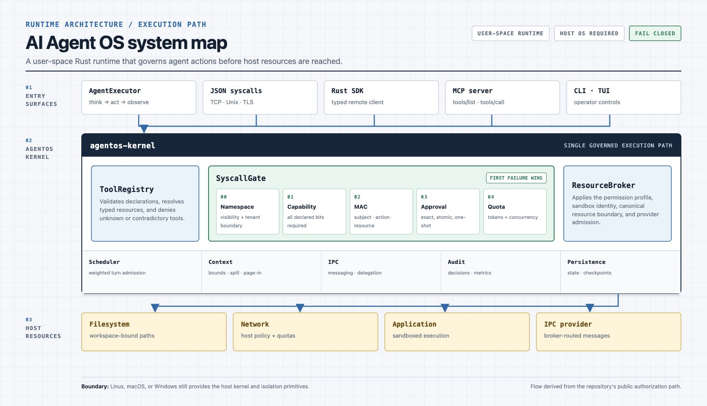
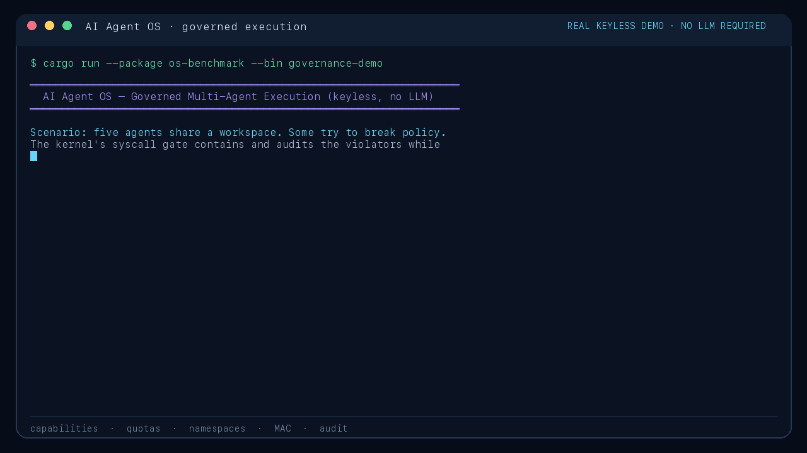

<p align="center">
  
</p>

<p align="center"><em>Deterministically rendered from <a href="docs/assets/system-map.html">HTML/CSS source</a>; the flow mirrors the public authorization path in this repository.</em></p>

<h1 align="center">AI Agent OS</h1>

<p align="center">
  <strong>A Rust runtime that governs AI agents like an operating system governs processes.</strong>
</p>

<p align="center">
  <a href="https://github.com/surya-koritala/AIagentOS/actions"></a>
  <a href="https://github.com/surya-koritala/AIagentOS/releases/latest"></a>
  <a href="LICENSE"></a>
  
</p>

<p align="center">
  <a href="#quick-start">Quick start</a> ·
  <a href="ROADMAP.md">Roadmap</a> ·
  <a href="docs/capabilities.toml">Capability evidence</a> ·
  <a href="CONTRIBUTING.md">Contributing</a>
</p>

> [!IMPORTANT]
> **v0.3.0 is the latest stable release. The development tree is not yet a
> production-qualified v1.0 application.** Its remaining security, isolation,
> recovery, provider, UX, and release-governance work is tracked in the
> [production roadmap](https://github.com/surya-koritala/AIagentOS/issues/105).
> Use [CHANGELOG.md](CHANGELOG.md) to distinguish released behavior from
> unreleased work.

## What is AI Agent OS?

AI Agent OS is a user-space control plane and runtime for long-lived AI agents.
It creates agents, schedules their work, bounds context and resource use,
brokers communication, persists state, and authorizes tool calls outside the
language model.

It is **not** a chatbot, a Linux distribution, a bootable kernel, or a replacement
for the host operating system. The Linux analogy describes its responsibility:
agents are treated like governed processes, while Linux, macOS, or Windows still
provides the actual host kernel and isolation primitives.

## Why an OS layer?

Running one agent is straightforward. Running many agents with different
permissions, budgets, workspaces, lifecycles, and communication boundaries
requires a shared governance layer.

AI Agent OS provides:

- **Process management** — create, clone, signal, kill agents (like fork/exec/kill)
- **Fair scheduling** — cooperative, CFS-inspired weighted turn admission
- **Context management** — per-agent/tenant/kernel active and durable bounds, verified spill references, explicit backpressure
- **Logical isolation** — tenant ownership, namespaces, cgroup-style quotas, and sandbox identities
- **Security** — fail-closed tool declarations, MAC policies, capabilities, approvals, and audit logging
- **IPC** — inter-agent messaging, delegation, and discovery (broker-routed via `IpcManager`)
- **Service supervision** — validated dependency graphs, durable ownership/history, health-driven restart/backoff, and atomic rolling reload
- **Packages** — signed archives, tenant trust roots, deterministic dependency locks, and transactional installs
- **LLM and memory backends** — typed provider failures, bounded resilient routing, actual provider/model accounting, and versioned semantic memory

> [!CAUTION]
> Capability-mediated workspace and HTTP isolation is public-API E2E tested.
> Digest-pinned Linux containers are live-qualified on a rootless daemon for
> breakout prerequisites, cancellation, and crash cleanup. Native host
> processes, unisolated browsers/peripherals, outbound host MCP, and
> macOS/Windows process containers are explicitly unsupported for untrusted
> agents and fail closed. See the
> [sandbox qualification contract](docs/SANDBOX_QUALIFICATION.md); independent
> penetration testing remains tracked by
> [#127](https://github.com/surya-koritala/AIagentOS/issues/127).
> Signed packages are engineering-qualified; the project-wide independent
> penetration test and v1 release decision remain tracked by
> [#127](https://github.com/surya-koritala/AIagentOS/issues/127).

## See governance in action

<p align="center">
  
</p>

The animation is generated from the real keyless demo—not a mocked interface.
It boots the kernel, creates five agents, contains capability, quota, namespace,
and MAC violations, records the audit decision, and proves compliant agents keep
running. Reproduce it without an API key, model, or network connection:

```bash
cargo run --package os-benchmark --bin governance-demo --locked
```

Durable pause/resume semantics and their hosted-provider limitations are
documented in [docs/CHECKPOINTS.md](docs/CHECKPOINTS.md).
The scheduling states, fairness unit, queue bounds, and Linux EEVDF differences
are documented in [docs/SCHEDULER.md](docs/SCHEDULER.md).
The token estimate, pinned-state, durable spill, page-in, and backpressure
contract is documented in [docs/CONTEXT_PRESSURE.md](docs/CONTEXT_PRESSURE.md).
The tenant-safe live snapshot used by the SDK, `agentctl`, and TUI is documented
in [docs/OPERATIONS_API.md](docs/OPERATIONS_API.md).
Declarative service boot ordering and the current supervision boundary are in
[docs/SERVICES.md](docs/SERVICES.md).

## Quick Start

### One command: bring up the server

The primary entry surface is `agent-server` — a long-lived kernel exposing the
JSON syscall protocol over TCP. One command builds the image, starts it, waits
until it actually answers a syscall, and prints the reply:

```bash
./scripts/quickstart.sh
```

That brings up a running, reachable, persistent server on
`tcp://localhost:7777` with **no API keys and no Ollama required** (the
enforcement / non-LLM syscalls boot keyless). State (the SQLite DB + rendered
config) persists in the `agentos-data` volume across restarts.

Equivalent raw one-liner, plus a manual round-trip:

```bash
docker compose up -d --build agentos-server
# Send a real NodeInfo syscall and read the reply:
exec 3<>/dev/tcp/127.0.0.1/7777; printf '{"op":"node_info"}\n' >&3; head -1 <&3
# -> {"status":"node_info","agent_count":0,"running_agents":0}
```

### Back up and recover persistent state

Inspect the versioned storage policy before provisioning retention and recovery.
This system-only command reports policy metadata—never live content, credentials,
or filesystem paths—and includes unresolved protection and external-system
boundaries:

```bash
cargo run -p agent-cli --bin agentctl --locked -- \
  --addr 127.0.0.1:7777 --token "$AGENT_SERVER_TOKEN" data-inventory
```

The Compose server creates or reuses an owner-only SQLCipher key in the separate
`agentos-keys` volume, fails closed if that key cannot authenticate persistent
state, and encrypts the database, WAL, and backups. It also enables automatic
hourly integrity-verified backups in `agentos-backups`, runs one at startup,
keeps at least 24, and expires additional backups after seven days. Back up the
key volume independently: an encrypted backup intentionally does not contain
its decryption key. Inspect bounded health:

```bash
cargo run -p agent-cli --bin agentctl --locked -- \
  --addr 127.0.0.1:7777 --token "$AGENT_SERVER_TOKEN" backup-status
```

Create a consistent backup while the server is running. The backup root is on
the server host and requires trusted system-operator access:

```bash
cargo run -p agent-cli --bin agentctl --locked -- \
  --addr 127.0.0.1:7777 --token "$AGENT_SERVER_TOKEN" \
  backup-create /var/lib/agentos/backups nightly_2026_07_25
```

For production, generate an operator signing identity once, retain the public
trust JSON in an independent recovery location, and mount the owner-only
private key into the server:

```bash
cargo run -p agent-cli --bin agentctl --locked -- \
  backup-key-generate release-2026.1 \
  /etc/agentos/backup-keys/release-2026.1.pk8 \
  /srv/recovery/agentos-trust/release-2026.1.json
```

Set `AGENTOS_BACKUP_SIGNING_KEY_PATH` and
`AGENTOS_BACKUP_SIGNING_KEY_ID=release-2026.1` together. New scheduled and live
operator backups will be signed. After selecting a recovery point, create its
non-overwriting recovery anchor in a separately governed location. The
signature proves who created the backup; the anchor pins the exact signed
manifest so a different, older valid backup is rejected:

```bash
cargo run -p agent-cli --bin agentctl --locked -- \
  backup-anchor-create /var/lib/agentos/backups/nightly_2026_07_25 \
  /srv/recovery/agentos-trust/release-2026.1.json \
  /srv/recovery/agentos-anchors/nightly_2026_07_25.json \
  --storage-key /etc/agentos/storage-keys/storage-generation-1.json

cargo run -p agent-cli --bin agentctl --locked -- \
  backup-verify /var/lib/agentos/backups/nightly_2026_07_25 \
  --storage-key /etc/agentos/storage-keys/storage-generation-1.json \
  --require-signature /srv/recovery/agentos-trust/release-2026.1.json \
  --require-anchor /srv/recovery/agentos-anchors/nightly_2026_07_25.json

# Stop agent-server first. The confirmation flag cannot bypass the lock.
cargo run -p agent-cli --bin agentctl --locked -- \
  backup-disaster-recover \
  /var/lib/agentos/backups/nightly_2026_07_25 \
  /etc/agentos/config.toml \
  /srv/recovery/agentos-trust/release-2026.1.json \
  /srv/recovery/agentos-anchors/nightly_2026_07_25.json \
  --confirm-offline
```

Production disaster recovery consumes the exact new-host `config.toml`, derives
the destination and storage key from it, and refuses to run while a kernel owns
the destination. Keep each anchor outside its backup directory and failure
domain. The CLI rejects direct co-location, but filesystem paths alone cannot
prove independent or immutable custody.

The command keeps the old database as rollback until the restored configuration
boots the full kernel and every persisted agent is re-admitted to enforcement.

If the configured database itself is corrupt and normal restore refuses to
checkpoint it, keep the server stopped and use the separate forensic path. The
expected installation UUID must come from independently retained installation
records; do not copy it blindly from the candidate backup:

```bash
cargo run -p agent-cli --bin agentctl --locked -- \
  backup-corruption-recover \
  /var/lib/agentos/backups/nightly_2026_07_25 \
  /etc/agentos/config.toml \
  /srv/recovery/agentos-trust/release-2026.1.json \
  /srv/recovery/agentos-anchors/nightly_2026_07_25.json \
  5df0185b-03c3-4f1d-8026-2d99d4d82f22 \
  --confirm-offline
```

Successful recovery reports an owner-only quarantine containing the original
database and any WAL/SHM files. Treat it as sensitive forensic evidence and
securely remove it only after independently accepting the recovered state.
See [the durability runbook](docs/DURABILITY.md#corrupt-database-recovery).

To move a complete installation to a fresh database or a new storage-key
generation, stop the server and use the versioned portable format. The bundle
is intentionally plaintext and contains every durable tenant and system record,
so transport it through a trusted channel, keep its directory owner-only, and
securely remove it after the destination is verified:

```bash
cargo run -p agent-cli --bin agentctl --locked -- \
  storage-portable-export /var/lib/agentos/agent_os.db \
  /srv/transfer/agentos-portable \
  --storage-key /etc/agentos/storage-keys/storage-generation-1.json \
  --confirm-offline
cargo run -p agent-cli --bin agentctl --locked -- \
  storage-portable-verify /srv/transfer/agentos-portable
cargo run -p agent-cli --bin agentctl --locked -- \
  storage-portable-import /srv/transfer/agentos-portable \
  /var/lib/agentos-new/agent_os.db \
  --storage-key /etc/agentos/storage-keys/storage-generation-2.json \
  --confirm-offline
```

Automatic backup configuration, exact durability boundaries, lower-level
offline restore, and remaining disaster-recovery work are documented in
[docs/DURABILITY.md](docs/DURABILITY.md).

Connect with the SDK or any client speaking newline-delimited JSON syscalls.
See [the public protocol contract](docs/PROTOCOL.md) for version negotiation,
machine-readable schemas, typed errors, ordered token streaming, exact-request
cancellation, framing/deadline limits, and conformance fixtures;
[docs/SERVER_QUICKSTART.md](docs/SERVER_QUICKSTART.md) covers deployment.

### From source

```bash
# Clone
git clone https://github.com/surya-koritala/AIagentOS.git
cd AIagentOS

# Run the complete locked workspace regression suite
cargo test --workspace --exclude tauri-app --locked

# Run the deterministic enforcement demo (no API key or model)
cargo run --package os-benchmark --bin governance-demo --locked

# Run the CLI agent (requires Azure OpenAI or OpenAI API key)
export AZURE_OPENAI_API_KEY="your-key"
export AZURE_OPENAI_ENDPOINT="https://your-resource.openai.azure.com"
export AZURE_OPENAI_DEPLOYMENT="gpt-4o"
export AZURE_OPENAI_API_VERSION="2024-08-01-preview"
cargo run --package agent-cli
```

## Kernel modules

| Category | Modules |
|----------|---------|
| **Process Mgmt** | `agent_struct`, `agent_syscalls`, `agent` |
| **Scheduling** | `cfs`, `scheduler` |
| **Memory** | `context`, `context_paging` |
| **Tool System** | `tools`, `custom_tools` (descriptor/mount prototypes are experimental) |
| **Networking** | `ipc` |
| **Security** | `mac`, `permissions`, `namespaces`, `sandbox` |
| **Resource Control** | `cgroups`, `rate_limit`, `production` |
| **Init & Services** | `init_system`, `agentps` (the `agentctl` operator is an SDK-backed CLI binary) |
| **Observability** | `observability`, `procfs`, `event_loop` |
| **Syscall Layer** | `syscall_server` JSON ABI (`syscall_interface` is experimental) |
| **Execution** | `execution`, `planning`, `editing`, `delegation` |
| **Integrations** | `connector`, `mcp`, `github`, `database` |
| **Platform** | `config`, `sysctl`, `package`, `marketplace`, `auth` |
| **Intelligence** | `learning`, `indexer`, `vision` |
| **Infrastructure** | `docker_sandbox`, `modules`, `prerequisites`, `shell`, `agentpkg` |

## How It Maps to Linux

Capability maturity is controlled by the machine-readable
[capability registry](docs/capabilities.toml), using the five levels Scaffolded,
Unit-tested, Integrated, Public-API E2E, and Production-qualified. CI verifies
that every public kernel module is classified and rejects unsupported maturity
promotions. The table below is a concise registry view, not a separate status
source. Standalone supporting modules are classified individually in the
[secondary-capability disposition](docs/SECONDARY_CAPABILITIES.md); their mere
presence in the Rust crate is not a v1 support claim.

| Linux | AI Agent OS | Status |
|-------|-------------|--------|
| Capabilities | Validated declarations plus gate checks on every public tool path | Public-API E2E — [#108](https://github.com/surya-koritala/AIagentOS/issues/108) |
| SELinux / AppArmor | `MacEngine` and declarative policy | Public-API E2E — [#108](https://github.com/surya-koritala/AIagentOS/issues/108) |
| cgroups | Token and agent-count accounting/limits | Integrated — [#109](https://github.com/surya-koritala/AIagentOS/issues/109) |
| `task_struct` | `AgentStruct` (Uuid + u64 PID translation) | Unit-tested — [#112](https://github.com/surya-koritala/AIagentOS/issues/112) |
| Signals (SIGKILL, SIGSTOP) | Agent signal/state primitives | Unit-tested — [#112](https://github.com/surya-koritala/AIagentOS/issues/112) |
| Unix sockets / IPC | Messaging, delegation, and discovery | Unit-tested — [#112](https://github.com/surya-koritala/AIagentOS/issues/112) |
| systemd | Validated service files, dependencies, durable health/restart supervision, and rolling reload | Production-qualified — [#118](https://github.com/surya-koritala/AIagentOS/issues/118) |
| syscall interface | Versioned JSON wire protocol; numbered table explicitly experimental | Public-API E2E — [#116](https://github.com/surya-koritala/AIagentOS/issues/116) |
| `fork()/clone()` | `agent_clone(flags)` primitive | Unit-tested — [#112](https://github.com/surya-koritala/AIagentOS/issues/112) |
| CFS-inspired scheduler | Cooperative weighted turn/provider admission, bounded aging, priority inheritance, and metrics | Production-qualified — [#114](https://github.com/surya-koritala/AIagentOS/issues/114) |
| Context pressure (not virtual memory) | Hierarchical active-prompt admission, durable-byte quotas, verified/retained spills, explicit backpressure | Production-qualified — [#115](https://github.com/surya-koritala/AIagentOS/issues/115) |
| Namespaces | Tool and IPC visibility primitives | Unit-tested — [#107](https://github.com/surya-koritala/AIagentOS/issues/107) |
| VFS + mount | Experimental descriptor/mount prototypes, excluded from v1 | Scaffolded — [ADR 0001](docs/ADR-0001-PUBLIC-ABI.md) |
| `/proc` + sysctl analogue | Remote tenant-safe typed snapshot, scoped gate/package views, and durable audited tunables | Production-qualified — [#117](https://github.com/surya-koritala/AIagentOS/issues/117) |
| apt/rpm | Signed data archives, tenant trust/revocation, semver lockfiles, durable registry, and transactional install/upgrade/rollback/remove | Production-qualified engineering path — [#119](https://github.com/surya-koritala/AIagentOS/issues/119) |

## How enforcement works in practice

Every executor, JSON syscall, MCP, and SDK-backed tool call uses
`ToolRegistry::authorize_and_acquire_call` and the declaration-aware syscall
gate:

```
agent → AgentExecutor::execute_tool
      → ToolRegistry::authorize_and_acquire_call
          declaration validation + typed resource extraction
      → SyscallGate::authorize_and_acquire_tool_call_declared
                                                (first failure wins)
          0. namespace visibility (tool tagged to a namespace ⇒ caller must be a member)
          1. capability checks    (every declared capability is required)
          2. MAC policy check     (subject/action/resource rule match)
          3. approval check       (exact contract + resource, atomically one-shot)
          4. cgroup membership validation
          5. concurrent tool slot (guard returned)
      → ResourceBroker            (permission + sandbox boundary)
      → binding execution         (guard held through filesystem/network/app/IPC)
```

A separate LLM admission path snapshots the agent's stable
root → tenant → profile → agent cgroup hierarchy, atomically reserves provider
RPM/TPM plus every hierarchical token scope and a provider-enforced output
allowance in SQLite, verifies that membership did not change, and then invokes
the model. A successful response reconciles quota to the larger of provider
total usage and the serialized prompt floor plus output, in the original fixed
Unix-minute epoch. Provider-reported usage remains the separate invoice/billing
record. The tool gate's payload-size compatibility field is never charged.
Tool-call JSON and results that later become part of an LLM prompt are counted
as real provider input.

A denial returns a structured tool failure, so the model can recover without the
kernel trusting it to obey policy. Registration, adversarial ordering, approval
replay, namespace/tenant isolation, and public-path behavior are covered by
`crates/kernel/src/tools.rs`, `crates/kernel/src/syscall_gate.rs`,
`tests/src/gate_adversarial_props.rs`, and `tests/src/os_enforcement.rs`.

The MAC policy at step 2 is **authorable as a declarative document** — operators write rules in TOML, validate and dry-run them with `agent policy validate` / `agent policy explain`, and point the kernel at a `policy_file`. See [docs/POLICY.md](docs/POLICY.md).

## Demos and benchmarks

The repository keeps demonstrations reproducible instead of publishing hardware-
independent performance claims without a qualification run:

```bash
# Keyless proof of capability, quota, namespace, MAC, audit, and containment
cargo run --package os-benchmark --bin governance-demo --locked

# Keyless enforcement, scheduler, and procfs checks with a pass/fail result
cargo run --package os-benchmark --bin os-demo --locked

# Broader benchmark suite; results depend on the host and provider configuration
cargo run --package os-benchmark --bin os-benchmark --locked

# Deterministic exact-vs-ANN retrieval gate (JSON output; no model/network)
cargo run --package os-benchmark --bin memory-qualification --locked

# Validate the versioned eight-profile capacity suite
cargo run --package os-benchmark --bin capacity-qualification --locked -- --validate

# Non-publishable development smoke across every capacity profile
cargo run --package os-benchmark --bin capacity-qualification --locked -- \
  --all --smoke --output target/qualification/capacity-smoke.json

# Validate and smoke-test bounded overload and graceful degradation
cargo run --package os-benchmark --bin resilience-qualification --locked -- --validate
cargo run --package os-benchmark --bin resilience-qualification --locked -- \
  --all --smoke --output target/qualification/resilience-smoke.json

# Validate the full-day resource/leak soak contract
cargo run --package os-benchmark --bin soak-qualification --locked -- --validate

# Non-evidence five-second resource sampler regression
export AGENTOS_QUALIFICATION_ENVIRONMENT="local-smoke"
cargo run --package os-benchmark --bin soak-qualification --locked -- \
  --smoke --state-dir target/qualification/resource-soak-smoke-state \
  --output target/qualification/resource-soak-smoke.json
```

The versioned [production observability contract](docs/OBSERVABILITY.md) now
defines bounded metrics, request correlation, release-candidate SLO targets,
checked-in Prometheus alerts, and their runbooks. The 24-hour soak, chaos,
game-day, and publishable performance qualification still remain tracked by
[#125](https://github.com/surya-koritala/AIagentOS/issues/125).
The [capacity qualification guide](docs/CAPACITY_QUALIFICATION.md) defines the
strict idle, many-agent, long-context, tool-heavy, provider-latency,
tenant-contention, signed-package, and restart workload suite. Fixture results
are always labeled non-publishable until an exact release candidate is run on
the intended deployment and completes the remaining #125 proof.
The [resilience qualification guide](docs/RESILIENCE_QUALIFICATION.md) covers
turn overload, slow clients, provider outage, exact-request cancellation
storms, disk-full rollback, prolonged database locks, and provider-network
partition recovery, including the explicit `max_waiting_turns` admission limit.
The extended-security workflow retains a fail-closed release-mode report for
all seven deterministic scenarios, bound to the exact clean commit.
The [resource and leak soak guide](docs/SOAK_QUALIFICATION.md) defines the
separate 24-hour target-host run, retained process/SQLite/admission samples,
proof eligibility, and the exact work that remains after the harness exists.

## Architecture Docs

- [`ROADMAP.md`](ROADMAP.md) — current phase plan with exit criteria (start here)
- [`CLAUDE.md`](CLAUDE.md) — orientation for AI assistants working in the repo
- [`docs/ARCHITECTURE.md`](docs/ARCHITECTURE.md) — Linux kernel → AI Agent OS mapping
- [`docs/POLICY.md`](docs/POLICY.md) — authoring, validating, and explaining MAC policy
- [`docs/ACCOUNTING.md`](docs/ACCOUNTING.md) — usage, pricing, quotas, and metrics contract
- [`docs/OBSERVABILITY.md`](docs/OBSERVABILITY.md) — SLOs, traces, metrics, alerts, and runbooks
- [`docs/CAPACITY_QUALIFICATION.md`](docs/CAPACITY_QUALIFICATION.md) — reproducible workload profiles and sizing method
- [`docs/RESILIENCE_QUALIFICATION.md`](docs/RESILIENCE_QUALIFICATION.md) — overload, slow-peer, and dependency-failure evidence
- [`docs/SOAK_QUALIFICATION.md`](docs/SOAK_QUALIFICATION.md) — 24-hour target resource/leak evidence contract
- [`docs/COMPLETE_SPEC.md`](docs/COMPLETE_SPEC.md) — long-form implementation spec
- [`docs/FULL_ROADMAP.md`](docs/FULL_ROADMAP.md) — long-form vision roadmap

## LLM Providers

Adapters run behind a connector with typed errors, circuit breaking,
compatibility-checked failover, bounded retry/backoff, cancellation/timeouts,
and durable worst-case attempt admission. Pull-request tests use local fixtures;
nightly protected workflows separately record `passed`, `failed`, or `not_run`
live evidence. No provider is production-qualified merely because its fixture
passes. See the complete [provider and memory qualification
contract](docs/PROVIDERS.md).

| Provider | Status |
|----------|--------|
| Azure OpenAI | Fixture-qualified native SSE, tools, usage, typed errors; protected live evidence not yet run |
| OpenAI | Fixture-qualified text/tools/usage, configured model, typed errors; protected live evidence not yet run |
| Anthropic (Claude) | Fixture-qualified text/tools/usage, configured model, typed errors; protected live evidence not yet run |
| Gemini | Fixture-qualified text/usage; native tools unsupported; protected live evidence not yet run |
| Groq | Fixture-qualified text/tools/usage; protected live evidence not yet run |
| DeepSeek | Fixture-qualified text/tools/usage; protected live evidence not yet run |
| Hugging Face | Fixture-qualified text; native tools and provider usage unsupported; protected live evidence not yet run |
| vLLM | Fixture-qualified OpenAI-compatible text/tools/usage; protected endpoint evidence not yet run |
| Local (Ollama) | Fixture-qualified text/usage with explicit local-to-cloud failover protection; protected endpoint evidence not yet run |
| On-device Candle/GGUF | CPU-only quantized Llama-family path with template, size, context, cancellation, and failure checks; provisioned real-model evidence not yet run |

## Contributing

See [CONTRIBUTING.md](CONTRIBUTING.md). The project uses AGPL-3.0 — all modifications must be shared.

## License

[AGPL-3.0](LICENSE) — like Linux uses GPL-2.0, we use AGPL-3.0 to ensure all improvements to the OS are shared with the community.
